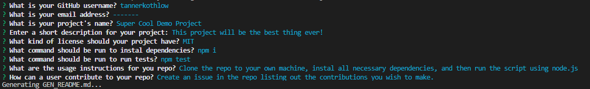
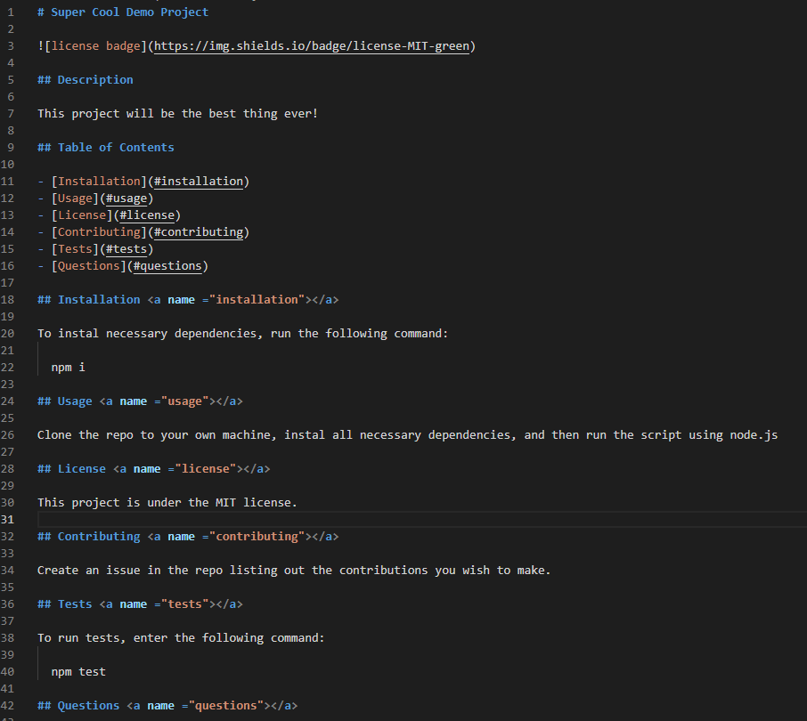
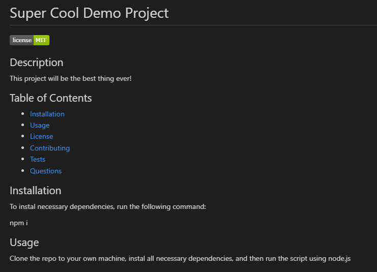

# Week 9: README Generator

## Description

For the ninth week in our coding bootcamp, we were tasked with working from starter code to create a script that would generate a README file populated with user submitted information. We were to accomplish this using node.js's File System module as well as Inquirer.

This assignment was refreshing after the previous two weeks of Project 1 work. No juggling HTML markup or contending with bulky API calls, just a simple JS script that does something. The first order of business then was importing Inquirer and running through the list of prompts as defined in the project guidelines. The responses were then sent into a generator function that compiled each answer into its own variable for ease of access (as opposed to data.projName) and each variable was placed in its respective spot in a markdown template. It's unfortunate that the template is just a big long dumb string with a couple of template literals inserted here and there but supposedly it's the best way of doing it (so far in our course at least).

After tinkering around with the formatting of the generated README, we were also required to include a hyperlinked image of a licensing badge generated via shields.io (credit and hyperlink under "License"). To generate the badge, there's a simple conditional statement that takes in the desired license from the user and returns the badge data URL formatted as "https://img.shields.io/-license-(type of license)-(color)" which is placed at the top of the README.

Overall this assignment wasn't too much of a brainbuster, but a nice introduction to node.js and Inquirer.

## Installation

(node.js for VS Code is required)

Clone the repository to your machine. Once completed open the integrated terminal at index.js and enter "npm i" This will install all the necessary dependencies.

## Usage

- To begin entering data for your README, invoke "node index.js" in the integrated terminal and you will be presented with a number of questions. Answer all questions accordingly, blank answers will be interpreted as an empty string.

- Your file will be generated as "GEN_README.md" in order to avoid conflicts with other README's that you may have present. You may now rename, edit, and add to the generated file however you please in your text editor of choice.

- When previewing, the badge displaying the chosen license (if one was chosen) will display at the top.

Additionally, consult [this brief demo video](https://drive.google.com/file/d/1RXKGElOvQM572t7jaVA_yg0hc3EsxzvR/view?usp=sharing) for a live demonstration.

## License 

Standard MIT license, coursework.

Starter code provided by UofM Full Stack Coding Bootcamp.

Licensing badge generated with [shields.io](https://shields.io/)
